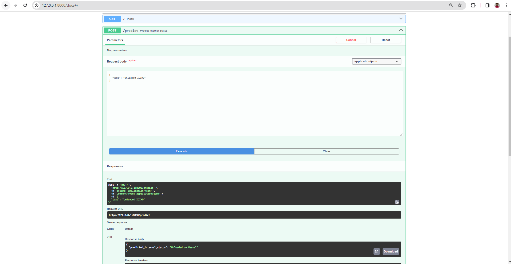
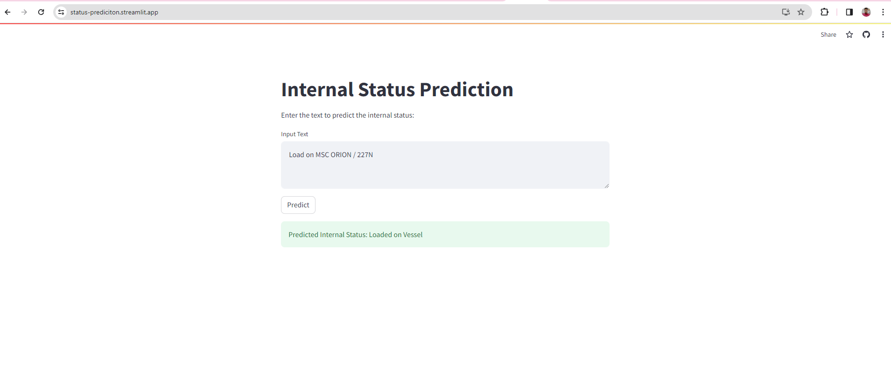

# Data Science and Machine Learning Engineer Task:

Problem Statement : Given the dataset which has the external status description, we have to predict the internal status.

Approach : This task is a multi label classification task and I think we have to do some form of Data Enrichment here, where the same input is indicated by different text and we have to make sure we catch all of them and put them in certain defined category. 

Steps:

1. Basic Data check for null values and duplicates: 
- There are no null values in the dataset.
- Although there are many duplicates present, I have not dropped them as large data can be helpful for ML modeling.

2. Exploratory Data Analysis:

- Frequency plot for the target variables to get sense of distribution of class labels.
- Top n words occuring in the external status description.
- Wordcloud for each internal status.

3. Data Cleaning to be applied on external status description: 
- Remove trails, lowercase the characters, remove anything which isn't Alphabets.
- Remove stopwords except for (on,in,of,off).
- Apply lematization on the words.

4. Split the dataset:
- Use the cleaned external status description as feature
- Train size : (1038, 1) / Test size : (184, 1)

5. Data Preprocessing:
- Text is vectorized using TFIDF vector with number of features as 99.
- X-train size : 1(038, 99) / X_test size : (184, 99)
- Target variables are encoded with Label Encoder.

6. Calculating class weights:
- As we have the multi label classification problem and the classes are not balanced so these weights are caluclated.
- These weights low weight to majority class and high weight to minority class.
- This is specifically used for tree based models.

7. Model architecture and evaluation:
- I have tried 3 Models: Random Forest, LGBM and Neural Network
- All of them gave F1 score of 1, which is very good.
- The basic architecture of Neural Network is as follows.
 
  A. **Input Layer:** The model begins with a Dense layer comprising 64 neurons and employing the ReLU activation function. This layer accepts input data with a shape defined by input_dim, representing the number of features in the input dataset.

    B. **Dropout Layer:** To prevent overfitting, a dropout layer with a dropout rate of 0.5 is added after the first Dense layer.

    C. **Hidden Layers:** There's another Dense layer with 32 neurons and ReLU activation, introducing additional capacity for learning complex patterns in the data.

    D. **Output Layer:** The final Dense layer consists of num_classes neurons, corresponding to the number of unique classes in the target variable. It utilizes the softmax activation function to output class probabilities.

8. Modeling Training:
- We give an input text in form of a string.
- The text is cleaned by the cleaning function.
- TFIDF vectorizer transforms the cleaned text into a vector for the model.
- This vector is fed to the model and then we get the prediction probabilities and get the maximum probability.
- Once we get the label, we use the inverse Label encoder to get the output in text format.

9. API Implementation (FastAPI):
- **API Endpoint Definition:** The FastAPI application defines a POST endpoint /predict, which accepts text data as input for predicting internal status. This endpoint is implemented using the predict_internal_status function, which preprocesses the input text, applies a pre-trained model for prediction, and returns the predicted internal status.

- **Model Loading and Preprocessing:** The application loads a pre-trained model (model.h5), TF-IDF vectorizer, and label encoder from pickle files. The input text is preprocessed using NLTK for text cleaning, including lowercasing, removal of stopwords, and lemmatization, ensuring consistency in the text format before feeding it to the model.

- **API Documentation and Usage:** The application provides a default message for the root endpoint (/) and detailed documentation for the /predict endpoint. Users can interact with the API by sending POST requests containing text data to obtain predictions for internal status based on the trained model. Better to use docs for better interaction.

10. Deployed Model (streamlit): Please find the link below for model

[Deployed Model](https://status-prediciton.streamlit.app/)

